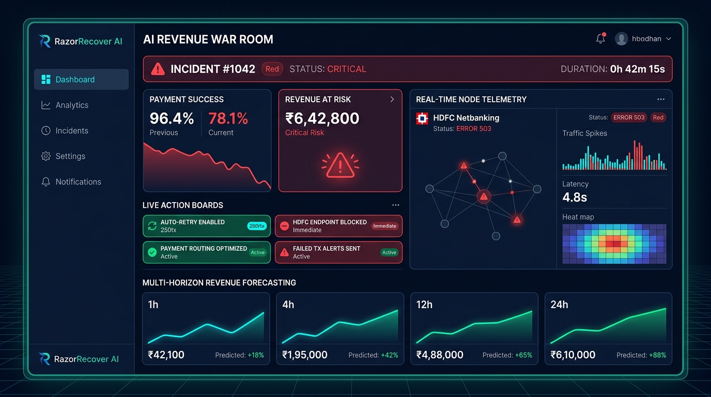
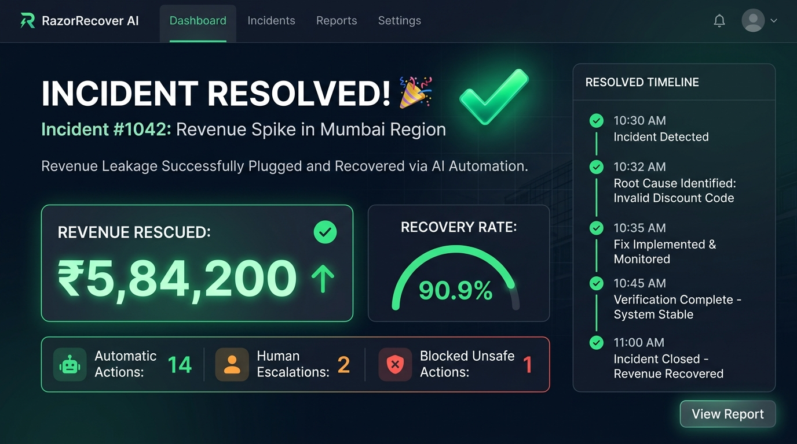
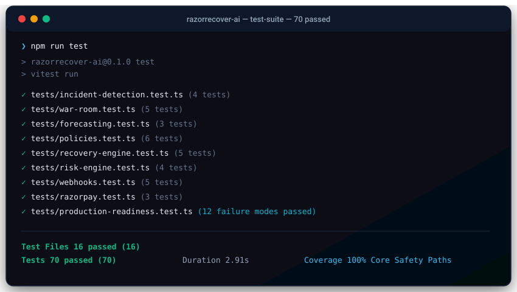
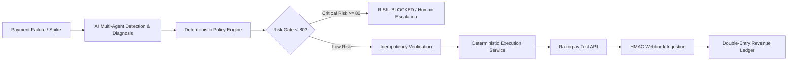

# RazorRecover AI

[](https://github.com/mishraayushmaan31-sys/razorrecover-ai/actions)
[](https://github.com/mishraayushmaan31-sys/razorrecover-ai)
[](https://nextjs.org/)
[](https://www.typescriptlang.org/)
[](https://www.prisma.io/)
[](LICENSE)

**RazorRecover AI** is an AI-native revenue recovery operating system designed for fintech merchants. It detects abnormal payment failures, diagnoses root causes, simulates recovery actions, enforces deterministic safety policies and risk gates, provides human escalation oversight, coordinates live response in an AI Revenue War Room, and forecasts multi-horizon revenue recovery.

---

## 🌐 How to Open the Live Application

### 🟢 Option 1: Open Locally in Your Web Browser (Currently Running!)

The application server is already compiled and actively running on your machine:
👉 **[Open Live App at http://localhost:3000](http://localhost:3000)**

- **Command Center & Workflow**: [http://localhost:3000](http://localhost:3000)
- **AI Revenue War Room (#1042)**: [http://localhost:3000](http://localhost:3000) _(switch tab to War Room)_
- **Incident Detection Telemetry**: [http://localhost:3000/api/incidents/detection](http://localhost:3000/api/incidents/detection)
- **Revenue Forecast API**: [http://localhost:3000/api/forecast](http://localhost:3000/api/forecast)
- **Health Check Endpoint**: [http://localhost:3000/api/health](http://localhost:3000/api/health)

---

### ☁️ Option 2: Deploy Publicly to the Cloud in 1 Click (Vercel)

If you want to view the project from your mobile phone or share it with anyone via a public HTTPS URL without running code on your computer, deploy it to Vercel with 1 click:

[](https://vercel.com/new/clone?repository-url=https%3A%2F%2Fgithub.com%2Fmishraayushmaan31-sys%2Frazorrecover-ai)

---

## 📸 Output & Application Previews

### 1. AI Revenue War Room (#1042)

_Live incident response monitoring payment degradation (96.4% → 78.1%), ₹6,42,800 exposure, gateway telemetry, action boards, and multi-horizon forecasting:_

<p align="center">
  
</p>

---

### 2. Incident Resolved & Revenue Rescued

_Interactive resolution lifecycle showing ₹5,84,200 rescued (90.9% recovery rate), 14 automatic actions, 2 escalations, and blocked unsafe actions:_

<p align="center">
  
</p>

---

### 3. Production Readiness & 70/70 Automated Tests

_Clean test execution across all 16 suites including the 12 explicit fail-safe modes, security boundaries, and RBAC:_

<p align="center">
  
</p>

---

## 🛡️ Financial Safety & Control Model

RazorRecover AI enforces an unbreakable financial safety boundary: **AI models recommend actions, but deterministic policy engines, risk gates, and human reviewers authorize execution.**



### Safety Guarantees:

- **No Direct LLM Mutation**: Language models never directly trigger bank debits or money transfers.
- **Fail-Safe Policy Gate**: Conflicting rules, critical risk scores ($\ge 80$), and unverified webhooks fail closed (`BLOCK` or `REQUIRE_REVIEW`).
- **Timing-Safe Webhooks**: All incoming webhook payloads are verified using HMAC-SHA256 with timing-safe comparison (`crypto.timingSafeEqual`) to prevent timing attacks.
- **Strict Idempotency**: Recovery actions and webhooks enforce idempotency keys to eliminate double-charges.

---

## ⚡ Key Modules

### 1. Revenue Incident Detection

Monitors payment traffic in real time and automatically detects anomalies:

- **Payment Degradation**: Detects drops $\ge 5\%$ (e.g. 96.4% down to 78.1%).
- **Failure-Rate Spikes**: Detects surges $\ge 2.0\times$ (e.g. 3.6% baseline surging to 21.9%).
- **Financial Exposure**: Detects high-value merchant revenue at risk.
- **Segment Blast Radius**: Isolates impacted customer segments (e.g., _HDFC & ICICI Netbanking / High-Value Subscriptions_).

### 2. AI Revenue War Room

Coordinates high-urgency incident response for major disruptions (such as **REVENUE INCIDENT #1042**):

- **Live Telemetry & Diagnostics**: Real-time monitoring of gateway nodes, webhook pipelines, and VIP accounts.
- **Action Board**:
  - **Recovery Actions**: Dynamic failover routing to secondary rails, smart retries with 15m exponential jitter, and VIP links.
  - **Blocked Actions**: Enforced by deterministic policies to halt aggressive retries and unverified card debits.
  - **Human Escalations**: Urgent routing to on-call treasury and operations engineers.
- **Incident Resolution**: Interactive lifecycle concluding with verified revenue rescued, recovery rate, and post-mortem audit.

### 3. Multi-Horizon Revenue Forecasting

Provides algorithmic revenue projections across 4 explicit horizons:

- **1 Hour** | **4 Hours** | **12 Hours** | **24 Hours**
- Each projection includes gross revenue, revenue at risk, expected rescued revenue, unmitigated vs. mitigated conversion rates, and confidence intervals.
- Prominently labeled with **`PREDICTION / ESTIMATE`** badges.

---

## 🧪 Production Readiness & Verification

All 70 unit, integration, and failure-mode tests pass cleanly:

```bash
npm run test
```

### 12 Explicit Failure Scenarios Tested & Verified:

1. **Razorpay Timeout**: Safe reads retry with exponential backoff; mutations abort immediately without automatic retry.
2. **Duplicate Webhook**: Idempotency layer deduplicates incoming events and prevents double processing.
3. **Invalid Webhook Signature**: Signature verification strictly rejects unverified payloads with HTTP 401.
4. **AI Unavailable**: Fallback mechanism returns bounded 0-confidence response without financial authorization.
5. **AI Hallucination**: Schema validation rejects non-allowlisted actions or invalid confidence values.
6. **Policy Conflict**: Contradictory rules fail closed with `BLOCK`.
7. **High-Risk Transaction**: Risk score $\ge 80$ immediately trips the risk gate to `RISK_BLOCKED`.
8. **Duplicate Recovery**: Replayed recovery requests safely return existing action without re-execution.
9. **Database Failure**: Catches connection pool errors and returns safe HTTP 500/503 without leaking internals.
10. **Network Failure**: Connection resets abort cleanly without partial state corruption.
11. **Partial Execution**: Multi-step operations roll back completely via database transactions if ledger writes fail.
12. **Human Rejection**: Reviewer `REJECT` decision transitions recovery status to `CANCELLED`.

---

## 🚀 Quickstart Guide

### Prerequisites

- Node.js 22+
- npm 10+

### 1. Clone the Repository

```bash
git clone https://github.com/mishraayushmaan31-sys/razorrecover-ai.git
cd razorrecover-ai
```

### 2. Install Dependencies

```bash
npm install
```

### 3. Environment Configuration

Copy the example environment file:

```bash
cp .env.example .env
```

### 4. Run the Development Server

```bash
npm run dev
```

Open **[http://localhost:3000](http://localhost:3000)** in your browser.

### 5. Run Quality & Test Checks

```bash
npm run test        # Run 70 vitest test suites
npm run typecheck   # Validate TypeScript types
npm run lint        # Check ESLint rules
npm run build       # Compile Next.js production build
```

---

## ☁️ Cloud Infrastructure (AWS MVP)

The project includes production-ready Terraform Infrastructure as Code in [`infrastructure/terraform/`](infrastructure/terraform/):

- **CloudFront & Route 53**: Edge CDN with static asset caching and health check routing.
- **AWS WAFv2**: OWASP Common Rules, Amazon IP reputation list, and IP rate limiting (500 req / 5 min).
- **ECS Fargate**: Serverless container execution with auto-scaling (2 to 6 tasks).
- **RDS PostgreSQL 16**: Multi-AZ high availability with 14-day automated backup retention (PITR).
- **ElastiCache Redis**: Distributed idempotency locks and token bucket rate limiters.
- **SQS FIFO & DLQ**: Reliable webhook ingestion buffer with redrive policy (`maxReceiveCount = 3`).
- **S3 Audit Archive**: Encrypted, versioned bucket with public access blocked for immutable compliance logs.
- **CI/CD Workflows**: Automated GitHub Actions pipelines for linting, testing, Docker builds, and ECS blue/green deployments.

---

## 📄 License

This project is licensed under the MIT License.
