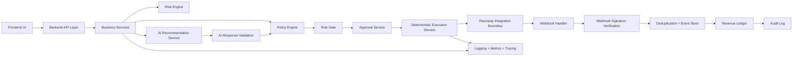

# RazorRecover AI – Technical Architecture

## 1. Architectural principles

This system is designed to ensure that AI augments decision-making without bypassing deterministic controls.

### Core rule

AI Recommendation
→ Deterministic Business Logic
→ Policy Engine
→ Risk Engine
→ Execution Service
→ Payment Provider
→ Webhook Verification
→ Revenue Ledger

### Mandatory constraints

- The AI layer never directly executes money movement.
- No frontend access to Razorpay secrets.
- All AI outputs are validated server-side.
- Recovery actions run through deterministic policy enforcement.
- Financial and recovery actions use idempotency.
- Webhook signatures are verified and event duplication is prevented.
- Audit logs and ledger records are preserved.
- Demo mode is isolated from real and test payment data.

---

## 2. System overview

RazorRecover AI is a multi-layer fintech platform with a frontend application, backend services, policy and execution engine, payment provider boundary, and observability stack.

### High-level layers

- Presentation layer: Next.js frontend
- API layer: backend REST APIs and internal service interfaces
- Core business layer: risk engine, policy engine, approval orchestration, execution service, analytics, ledger
- AI layer: provider abstraction, structured outputs, validation, recommendation service
- Integration layer: Razorpay test-mode client, webhook handlers
- Data layer: PostgreSQL + Prisma, event store, audit store
- Platform layer: Docker, CI/CD, monitoring, logging, environment config

---

## 3. Frontend architecture

### Recommended stack

- Next.js App Router
- TypeScript
- React
- Tailwind CSS
- shadcn/ui or equivalent

### Frontend structure

- app/
  - (auth)/
  - (dashboard)/
  - (recovery)/
  - (incidents)/
  - (settings)/
  - api/
- components/
  - layout/
  - dashboard/
  - risk/
  - recovery/
  - incident/
  - approval/
  - ai/
  - common/
- lib/
  - api/
  - auth/
  - env/
  - formatting/
  - utilities/
- hooks/
  - useAuth
  - useMode
  - usePermissions
  - useApprovalQueue

### Frontend responsibilities

- render merchant dashboard and operational surfaces
- display risk, incident, and approval states
- surface AI recommendation panels with evidence and policy status
- provide safe, server-side action invocation only
- never store or transmit secrets
- clearly show Demo / Test / Production mode

### Frontend non-goals

- directly invoking money movement
- direct communication with Razorpay secrets
- direct access to privileged security operations

### Frontend request model

- all mutation calls go through backend APIs
- all financial actions are initiated through server-only orchestration
- all UI state updates are driven by server response plus ledger status

---

## 4. Backend architecture

### Service-oriented backend model

#### Core internal services

- merchant-service
- risk-service
- policy-service
- approval-service
- execution-service
- ledger-service
- audit-service
- incident-service
- ai-recommendation-service
- integration-service
- webhook-service
- notification-service
- analytics-service

### Backend boundaries

- API layer: routes and schema validation
- Service layer: business logic
- Domain layer: entities and rules
- Integration layer: external providers and event integration
- Persistence layer: Prisma + Postgres

### Execution chain

1. API receives a request or event
2. Request is validated and authenticated
3. Request context is resolved
4. Business context is loaded
5. Deterministic business logic runs
6. Policy engine evaluates permission and safety
7. Risk engine calculates or confirms risk posture
8. Approval is required when threshold is reached
9. Deterministic execution service performs approved actions
10. Ledger and audit records are persisted
11. Webhook or event processing is verified and deduplicated

---

## 5. Database architecture

### Database technology

- PostgreSQL
- Prisma ORM

### Core data domains

- merchants
- users
- permissions and roles
- payment attempts
- risk signals
- recovery opportunities
- policies
- approval requests
- execution records
- incidents
- webhook events
- revenue ledger
- audit log
- experiments
- AI memory

### Recommended schema groups

- auth/
- merchant/
- payments/
- risk/
- recovery/
- approvals/
- ledger/
- audit/
- integrations/
- experiments/

### Transaction requirements

The following operations require transactions:

- approval decisions tied to ledger mutation
- execution record creation plus ledger posting
- payment-recovery action processing that updates multiple tables atomically
- policy decision persistence with audit record creation
- webhook event state transitions that must be deduplicated and recorded transactionally

### Non-transactional operations

- analytics summarization
- ai recommendation retrieval
- event ingestion fan-out where eventual consistency is acceptable
- read-heavy dashboard queries

### Data segregation rules

- demo data table prefixes or environment labels
- test-mode records clearly marked with mode metadata
- production data isolated by environment and deployment boundary

---

## 6. API architecture

### API style

- REST for merchant/operator flows
- webhook endpoint for provider callbacks
- internal service-to-service APIs in structured JSON
- server-side validation on every request

### API layers

- public APIs: merchant and dashboard access
- internal APIs: backend-to-backend interactions
- provider APIs: Razorpay integration boundary only
- webhook APIs: provider callbacks and verification endpoints

### API categories

- Auth APIs
- Risk APIs
- Recovery APIs
- Simulation APIs
- Approval APIs
- Execution APIs
- Ledger APIs
- Audit APIs
- Incident APIs
- Copilot APIs
- Developer APIs

### API contract principles

- typed request/response objects
- explicit enumeration for mode and state
- idempotency keys on financial and recovery endpoints
- server-side validation of AI responses
- resource-level authorization checks

---

## 7. AI architecture

### AI architecture goal

The AI layer supports reasoning, summarization, and recommendation generation without being the enforcement point for financial action.

### AI stack

- provider abstraction layer
- structured output schema
- validation before persistence or response
- tool-calling only where allowed and constrained
- no direct account or payments mutation

### AI pipeline

- context assembly
- risk and opportunity retrieval
- prompt generation
- provider invocation
- structured response validation
- policy evaluation
- recommendation packaging
- human approval if required

### AI responsibilities

- explain risk and failure cause
- summarize recovery opportunity
- recommend safe next actions
- generate customer or incident summaries
- produce decision rationale with confidence score

### AI non-responsibilities

- direct money movement
- bypassing policy engine
- making final financial execution decisions
- direct access to secrets or provider credentials

### AI safety validation

- schema validation is required
- confidence threshold checks for recommendation quality
- risk classification and policy compatibility checks
- action output cannot be executed without deterministic service approval

---

## 8. Agent architecture

### Purpose of agents

Agents are orchestration components that coordinate specialized tasks such as:

- recommendation generation
- policy evaluation
- execution flow orchestration
- webhook handling
- incident correlation
- recovery workflow support

### Agent categories

- Research / recommendation agent
- Risk evaluation agent
- Recovery strategy agent
- Approval workflow agent
- Execution agent
- Incident triage agent
- Developer event inspection agent

### Agent guardrails

- agents do not directly execute provider actions
- agent outputs are passed to deterministic logic for final enforcement
- all actions require traces and approvals if required by policy
- system state is immutable and auditable

---

## 9. Queue and event architecture

### Synchronous operations

- authentication
- policy evaluation requests
- read access queries
- immediate approval actions for low-risk flows
- dashboard summary fetch

### Asynchronous operations

- incident correlation
- webhook processing fan-out
- AI recommendation generation
- recovery opportunity scoring
- ledger reconciliation/summary updates
- analytics aggregation
- notifications and escalations
- experiment evaluation and learning loops

### Recommended queue system

- Redis / queue service or managed message service
- topics or queues for events such as:
  - payment.failed
  - payment.success
  - webhook.received
  - workflow.approved
  - workflow.executed
  - incident.created
  - revenue.ledger.updated
  - ai.recommendation.generated

### Event handling rules

- events must be idempotent at the consumer level
- duplicate events must be deduplicated through unique event identifiers
- event processing should be retriable and durable
- serious downstream tasks should be event-driven rather than direct request-triggered

---

## 10. Webhook architecture

### Webhook goal

Process Razorpay callbacks safely and react to payment states without allowing unverified external events to mutate business state.

### Handler flow

1. provider sends signed webhook payload
2. backend verifies signature using configured secret
3. event payload is parsed and validated
4. event ID is checked for deduplication
5. event is stored with status (received, validated, processed, ignored, rejected)
6. event triggers business processing through a queue
7. downstream services update payment / risk / ledger state

### Security requirements

- verify signature before processing any event
- reject unsigned or altered requests
- deduplicate by event ID or signature hash
- store raw payload in a secure, immutable, access-restricted way if required
- no frontend access to webhook secrets

### Idempotency boundaries

- webhook processing must be idempotent by event ID
- execution operations triggered by webhook must also be idempotent by recovery or payment action key

---

## 11. Authentication architecture

### Authentication types

- merchant user login
- admin / operator role sign-in
- service-to-service authentication for internal APIs
- provider authentication handled server-side

### Recommended implementation

- NextAuth-compatible or secure auth provider for Next.js
- JWT or session-based server auth
- secure cookie or token strategy
- short-lived access tokens with refresh flow

### Principles

- no credentials in frontend code
- environment-based secret management
- least privilege at every route and service boundary

---

## 12. Authorization and RBAC

### Roles

- Merchant Admin
- Merchant Operator
- Revenue Analyst
- Risk Manager
- Finance Approver
- Developer / Integrations Engineer
- Security Admin
- Support User

### Permission model

Permissions are granted by role and scoped by merchant and environment.

#### Examples

- view:risk
- create:recovery_simulation
- approve:recovery_action
- execute:demo_action
- execute:test_action
- view:audit_ledger
- manage:kill_switch
- manage:integration_config

### Authorization boundaries

- route-level checks in frontend and backend
- server-side authorization on every sensitive action
- environment-aware permission enforcement
- explicit approval and escalation hierarchy for high-risk actions

---

## 13. Security boundaries

### Inbound boundaries

- frontend to API
- API to core services
- internal services to database
- webhook endpoints to internal event bus
- external provider to internal integration layer

### Security controls

- TLS everywhere
- signed webhooks
- env-based secrets and secret manager preference for production
- server-side validation of all business inputs
- least privilege access on all services
- no raw secrets exposed to client UI
- no direct database access from frontend

### Security zones

- public zone: landing page, auth endpoints
- merchant zone: dashboard, risk, recovery actions
- admin zone: approvals, policies, security, kill switch
- developer zone: event inspection, integration diagnostics
- provider zone: Razorpay integration only on server side

---

## 14. Logging, audit, and observability

### Logging

- structured JSON logs
- correlated request IDs
- operator and approver IDs attached when available
- include environment and mode

### Audit trail

- immutable or append-only action history
- approval decisions
- policy decisions
- execution state changes
- webhook validation records
- ledger changes
- risk and recovery event provenance

### Observability stack

- log aggregation
- metrics dashboards
- tracing for request lifecycle
- alerting on failed policies, execution issues, payment anomalies, and webhook failures

### Required observability signals

- revenue at risk counts
- active approvals
- blocked actions
- unsafe action attempts
- webhook processing failures
- AI recommendation validation errors
- execution latency and failure rates

---

## 15. Demo Mode architecture

### Purpose

Provide safe synthetic demonstration of the end-user workflow without risking financial operations or confusing synthetic data with real data.

### Demo mode rules

- synthetic merchant and transaction data only
- explicit mode tagging in UI and APIs
- no use of real payment or provider credentials
- demo actions must be clearly marked as non-production
- all demo actions stay within the demo environment and ledger path

### Demo mode boundaries

- can execute simulation or synthetic recovery actions
- cannot trigger actual financial actions with external providers
- must be clearly visible to every user

---

## 16. Razorpay integration boundary

### Integration boundary design

All Razorpay logic must live in a server-side integration boundary.

### Scope of the boundary

- Razorpay client configuration
- payment event validation
- webhook verification
- test-mode safe calls only during development
- provider event translation to internal domain events

### Out of scope for frontend

- secrets
- direct payment operations
- webhook secret usage
- direct API calls with privileged credentials

### Integration flow

- frontend requests a server action for a safe operation
- backend calls a Razorpay service in test or demo mode
- provider response is normalized into internal event types
- webhook verification and ledger processing occur server-side

---

## 17. Transaction boundaries and idempotency

### Required transaction boundaries

- create approval + write audit log + update action state
- create recovery execution + update execution status + ledger entry
- persist webhook event + mark deduplication state + queue downstream processing

### Idempotency keys

- recovery action execution
- approval actions
- webhook event processing
- payment provider create/update operations
- ledger updates triggered by state changes

### Key design rule

Every operation that changes revenue or financial state must be protected by an idempotency key and a unique business operation ID.

---

## 18. Synchronous vs asynchronous operation map

### Synchronous operations

- login / auth validation
- read merchant dashboard state
- risk summary fetch
- policy evaluation for policy checks that need immediate answers
- approval request creation for low-risk flows
- fetching audit or ledger records for a visible page

### Asynchronous operations

- AI recommendation generation
- payment webhook processing
- incident correlation and aggregation
- analytics recalculation
- notification dispatch
- recovery experiment evaluation
- non-immediate ledger summaries

---

## 19. Technical architecture diagram

---

## 20. Data flow description

### Normal risk and recovery flow

- merchant or operator triggers dashboard request
- backend loads risk context and similar records
- AI suggests a strategy
- policy engine validates that the action is safe
- risk gate applies threshold logic
- approval workflow triggers if required
- execution service performs the approved operation in demo or test mode
- provider boundary receives a safe server-side call
- webhook verification receives external payment or event updates
- ledger records the result and audit logs the process

### Critical rule

The AI layer may suggest, but the business logic and execution services decide and act.

---

## 21. Implementation foundation for next phase

The next phase should implement only the foundational technical architecture necessary to support product development:

- Next.js app shell
- backend service structure
- Prisma schema foundation
- policy engine skeleton
- risk and approval service skeleton
- auth and RBAC skeleton
- Razorpay integration boundary skeleton
- webhook verification and event deduplication skeleton
- protected logging and audit service skeleton

This is the minimal architecture required before building more product screens or business workflows.
